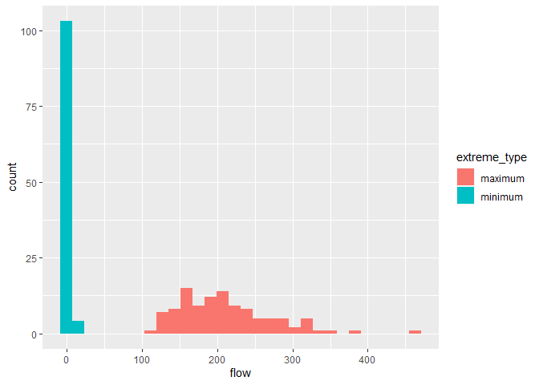
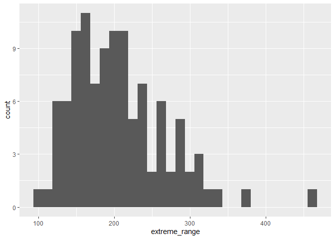
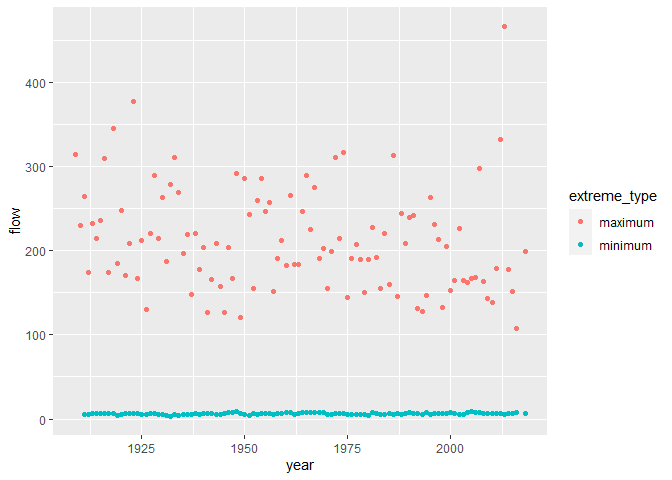
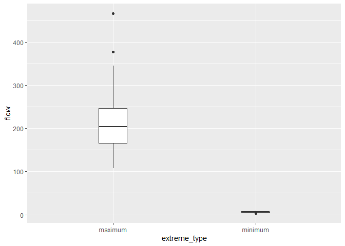
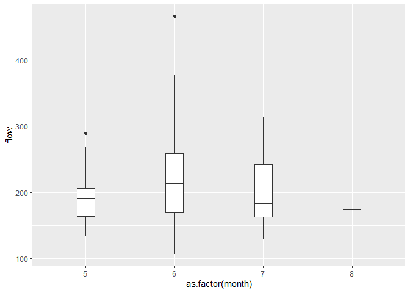

Mini Data-Analysis Deliverable 1
================

# Welcome to your (maybe) first-ever data analysis project!

And hopefully the first of many. Let’s get started:

1.  Install the [`datateachr`](https://github.com/UBC-MDS/datateachr)
    package by typing the following into your **R terminal**:

<!-- -->

    install.packages("devtools")
    devtools::install_github("UBC-MDS/datateachr")

2.  Load the packages below.

``` r
library(datateachr)
library(tidyverse)
```

    ## -- Attaching packages --------------------------------------- tidyverse 1.3.1 --

    ## v ggplot2 3.3.5     v purrr   0.3.4
    ## v tibble  3.1.5     v dplyr   1.0.7
    ## v tidyr   1.1.4     v stringr 1.4.0
    ## v readr   2.0.2     v forcats 0.5.1

    ## -- Conflicts ------------------------------------------ tidyverse_conflicts() --
    ## x dplyr::filter() masks stats::filter()
    ## x dplyr::lag()    masks stats::lag()

``` r
library(ggplot2)
```

3.  Make a repository in the <https://github.com/stat545ubc-2021>
    Organization. You will be working with this repository for the
    entire data analysis project. You can either make it public, or make
    it private and add the TA’s and Vincenzo as collaborators.

4.  When you go to submit, submit a URL to your repository to canvas.

# Instructions

More details regarding the instructions and points allocated to each
task can be found below. Briefly,

-   Each milestone is worth 30 points. The number of points allocated to
    each task will be annotated within each deliverable. Tasks that are
    more challenging will often be allocated more points.

-   10 points will be allocated to the reproducibility, cleanliness, and
    coherence of the analysis. While the three milestones will be
    submitted as independent deliverables, the analysis itself is a
    continuum - think of it as 3 chapters to a story. Each chapter, or
    in this case, portion of your analysis, should be easily followed
    through by someone unfamiliar with the content.
    [Here](https://swcarpentry.github.io/r-novice-inflammation/06-best-practices-R/)
    is a good resource for what constitutes “good code”. Learning good
    coding practices early in your career will save you hassle later on!

# Learning Objectives

By the end of this milestone, you should:

-   Become familiar with your dataset of choosing
-   Think of 4 questions that you would like to Answers with your data
-   Generate a reproducible and clear report using R Markdown

# Task 1: Choose your favorite dataset (10 points)

The `datateachr` package by Hayley Boyce and Jordan Bourak currently
composed of 7 semi-tidy datasets for educational purposes. Here is a
brief description of each dataset:

-   *apt\_buildings*: Acquired courtesy of The City of Toronto’s Open
    Data Portal. It currently has 3455 rows and 37 columns.

-   *building\_permits*: Acquired courtesy of The City of Vancouver’s
    Open Data Portal. It currently has 20680 rows and 14 columns.

-   *cancer\_sample*: Acquired courtesy of UCI Machine Learning
    Repository. It currently has 569 rows and 32 columns.

-   *flow\_sample*: Acquired courtesy of The Government of Canada’s
    Historical Hydrometric Database. It currently has 218 rows and 7
    columns.

-   *parking\_meters*: Acquired courtesy of The City of Vancouver’s Open
    Data Portal. It currently has 10032 rows and 22 columns.

-   *steam\_games*: Acquired courtesy of Kaggle. It currently has 40833
    rows and 21 columns.

-   *vancouver\_trees*: Acquired courtesy of The City of Vancouver’s
    Open Data Portal. It currently has 146611 rows and 20 columns.

**Things to keep in mind**

-   We hope that this project will serve as practice for carrying our
    your own *independent* data analysis. Remember to comment your code,
    be explicit about what you are doing, and write notes in this
    markdown document when you feel that context is required. As you
    advance in the project, prompts and hints to do this will be
    diminished - it’ll be up to you!

-   Before choosing a dataset, you should always keep in mind **your
    goal**, or in other ways, *what you wish to achieve with this data*.
    This mini data-analysis project focuses on *data wrangling*,
    *tidying*, and *visualization*. In short, it’s a way for you to get
    your feet wet with exploring data on your own.

And that is exactly the first thing that you will do!

1.1 Out of the 7 datasets available in the `datateachr` package, choose
**4** that appeal to you based on their description. Write your choices
below:

**Note**: We encourage you to use the ones in the `datateachr` package,
but if you have a dataset that you’d really like to use, you can include
it here. But, please check with a member of the teaching team to see
whether the dataset is of appropriate complexity. Also, include a
**brief** description of the dataset here to help the teaching team
understand your data.  

**Answers for 1.1**  
1: apt\_buildings  
2: steam\_games  
3: vancouver\_trees  
4: flow\_sample  

1.2 One way to narrowing down your selection is to *explore* the
datasets. Use your knowledge of dplyr to find out at least *3*
attributes about each of these datasets (an attribute is something such
as number of rows, variables, class type…). The goal here is to have an
idea of *what the data looks like*.

*Hint:* This is one of those times when you should think about the
cleanliness of your analysis. I added a single code chunk for you, but
do you want to use more than one? Would you like to write more comments
outside of the code chunk?

**Answers for 1.2**  
Four code chunks were used to find out the 3 attributes about each
datasets.  
*apt\_buildings*: includes 3455 row and 37 variables. The name and type
of variables were listed below. *<dbl>* represents double-precision
floating-point format, including id, no\_of\_elevators, rsn and so on.
*<chr>* represents character format, including air\_conditioning,
amenities, balconies and so on.

``` r
### EXPLORE apt_buildings ###
pillar::glimpse(apt_buildings)
```

    ## Rows: 3,455
    ## Columns: 37
    ## $ id                               <dbl> 10359, 10360, 10361, 10362, 10363, 10~
    ## $ air_conditioning                 <chr> "NONE", "NONE", "NONE", "NONE", "NONE~
    ## $ amenities                        <chr> "Outdoor rec facilities", "Outdoor po~
    ## $ balconies                        <chr> "YES", "YES", "YES", "YES", "NO", "NO~
    ## $ barrier_free_accessibilty_entr   <chr> "YES", "NO", "NO", "YES", "NO", "NO",~
    ## $ bike_parking                     <chr> "0 indoor parking spots and 10 outdoo~
    ## $ exterior_fire_escape             <chr> "NO", "NO", "NO", "YES", "NO", NA, "N~
    ## $ fire_alarm                       <chr> "YES", "YES", "YES", "YES", "YES", "Y~
    ## $ garbage_chutes                   <chr> "YES", "YES", "NO", "NO", "NO", "NO",~
    ## $ heating_type                     <chr> "HOT WATER", "HOT WATER", "HOT WATER"~
    ## $ intercom                         <chr> "YES", "YES", "YES", "YES", "YES", "Y~
    ## $ laundry_room                     <chr> "YES", "YES", "YES", "YES", "YES", "Y~
    ## $ locker_or_storage_room           <chr> "NO", "YES", "YES", "YES", "NO", "YES~
    ## $ no_of_elevators                  <dbl> 3, 3, 0, 1, 0, 0, 0, 2, 4, 2, 0, 2, 2~
    ## $ parking_type                     <chr> "Underground Garage , Garage accessib~
    ## $ pets_allowed                     <chr> "YES", "YES", "YES", "YES", "YES", "Y~
    ## $ prop_management_company_name     <chr> NA, "SCHICKEDANZ BROS. PROPERTIES", N~
    ## $ property_type                    <chr> "PRIVATE", "PRIVATE", "PRIVATE", "PRI~
    ## $ rsn                              <dbl> 4154812, 4154815, 4155295, 4155309, 4~
    ## $ separate_gas_meters              <chr> "NO", "NO", "NO", "NO", "NO", "NO", "~
    ## $ separate_hydro_meters            <chr> "YES", "YES", "YES", "YES", "YES", "Y~
    ## $ separate_water_meters            <chr> "NO", "NO", "NO", "NO", "NO", "NO", "~
    ## $ site_address                     <chr> "65  FOREST MANOR RD", "70  CLIPPER R~
    ## $ sprinkler_system                 <chr> "YES", "YES", "NO", "YES", "NO", "NO"~
    ## $ visitor_parking                  <chr> "PAID", "FREE", "UNAVAILABLE", "UNAVA~
    ## $ ward                             <chr> "17", "17", "03", "03", "02", "02", "~
    ## $ window_type                      <chr> "DOUBLE PANE", "DOUBLE PANE", "DOUBLE~
    ## $ year_built                       <dbl> 1967, 1970, 1927, 1959, 1943, 1952, 1~
    ## $ year_registered                  <dbl> 2017, 2017, 2017, 2017, 2017, NA, 201~
    ## $ no_of_storeys                    <dbl> 17, 14, 4, 5, 4, 4, 4, 7, 32, 4, 4, 7~
    ## $ emergency_power                  <chr> "NO", "YES", "NO", "NO", "NO", "NO", ~
    ## $ `non-smoking_building`           <chr> "YES", "NO", "YES", "YES", "YES", "NO~
    ## $ no_of_units                      <dbl> 218, 206, 34, 42, 25, 34, 14, 105, 57~
    ## $ no_of_accessible_parking_spaces  <dbl> 8, 10, 20, 42, 12, 0, 5, 1, 1, 6, 12,~
    ## $ facilities_available             <chr> "Recycling bins", "Green Bin / Organi~
    ## $ cooling_room                     <chr> "NO", "NO", "NO", "NO", "NO", "NO", "~
    ## $ no_barrier_free_accessible_units <dbl> 2, 0, 0, 42, 0, NA, 14, 0, 0, 1, 25, ~

*steam\_games*: includes 40833 row and 21 variables. The name and type
of variables were listed below. *<dbl>* represents double-precision
floating-point format, including id, achievements, original\_price, and
so on. *<chr>* represents character format, including url, types, name,
and so on.

``` r
### EXPLORE steam_games ###
pillar::glimpse(steam_games)
```

    ## Rows: 40,833
    ## Columns: 21
    ## $ id                       <dbl> 1, 2, 3, 4, 5, 6, 7, 8, 9, 10, 11, 12, 13, 14~
    ## $ url                      <chr> "https://store.steampowered.com/app/379720/DO~
    ## $ types                    <chr> "app", "app", "app", "app", "app", "bundle", ~
    ## $ name                     <chr> "DOOM", "PLAYERUNKNOWN'S BATTLEGROUNDS", "BAT~
    ## $ desc_snippet             <chr> "Now includes all three premium DLC packs (Un~
    ## $ recent_reviews           <chr> "Very Positive,(554),- 89% of the 554 user re~
    ## $ all_reviews              <chr> "Very Positive,(42,550),- 92% of the 42,550 u~
    ## $ release_date             <chr> "May 12, 2016", "Dec 21, 2017", "Apr 24, 2018~
    ## $ developer                <chr> "id Software", "PUBG Corporation", "Harebrain~
    ## $ publisher                <chr> "Bethesda Softworks,Bethesda Softworks", "PUB~
    ## $ popular_tags             <chr> "FPS,Gore,Action,Demons,Shooter,First-Person,~
    ## $ game_details             <chr> "Single-player,Multi-player,Co-op,Steam Achie~
    ## $ languages                <chr> "English,French,Italian,German,Spanish - Spai~
    ## $ achievements             <dbl> 54, 37, 128, NA, NA, NA, 51, 55, 34, 43, 72, ~
    ## $ genre                    <chr> "Action", "Action,Adventure,Massively Multipl~
    ## $ game_description         <chr> "About This Game Developed by id software, th~
    ## $ mature_content           <chr> NA, "Mature Content Description  The develope~
    ## $ minimum_requirements     <chr> "Minimum:,OS:,Windows 7/8.1/10 (64-bit versio~
    ## $ recommended_requirements <chr> "Recommended:,OS:,Windows 7/8.1/10 (64-bit ve~
    ## $ original_price           <dbl> 19.99, 29.99, 39.99, 44.99, 0.00, NA, 59.99, ~
    ## $ discount_price           <dbl> 14.99, NA, NA, NA, NA, 35.18, 70.42, 17.58, N~

*vancouver\_trees*: includes 146611 row and 20 variables. The name and
type of variables were listed below. *<dbl>* represents double-precision
floating-point format, including tree\_id, civic\_number,
on\_street\_block, and so on. *<chr>* represents character format,
including std\_street, genus\_name, species\_name, and so on. *<date>*
represents date format, including date\_planted.

``` r
### EXPLORE vancouver_trees ###
pillar::glimpse(vancouver_trees)
```

    ## Rows: 146,611
    ## Columns: 20
    ## $ tree_id            <dbl> 149556, 149563, 149579, 149590, 149604, 149616, 149~
    ## $ civic_number       <dbl> 494, 450, 4994, 858, 5032, 585, 4909, 4925, 4969, 7~
    ## $ std_street         <chr> "W 58TH AV", "W 58TH AV", "WINDSOR ST", "E 39TH AV"~
    ## $ genus_name         <chr> "ULMUS", "ZELKOVA", "STYRAX", "FRAXINUS", "ACER", "~
    ## $ species_name       <chr> "AMERICANA", "SERRATA", "JAPONICA", "AMERICANA", "C~
    ## $ cultivar_name      <chr> "BRANDON", NA, NA, "AUTUMN APPLAUSE", NA, "CHANTICL~
    ## $ common_name        <chr> "BRANDON ELM", "JAPANESE ZELKOVA", "JAPANESE SNOWBE~
    ## $ assigned           <chr> "N", "N", "N", "Y", "N", "N", "N", "N", "N", "N", "~
    ## $ root_barrier       <chr> "N", "N", "N", "N", "N", "N", "N", "N", "N", "N", "~
    ## $ plant_area         <chr> "N", "N", "4", "4", "4", "B", "6", "6", "3", "3", "~
    ## $ on_street_block    <dbl> 400, 400, 4900, 800, 5000, 500, 4900, 4900, 4900, 7~
    ## $ on_street          <chr> "W 58TH AV", "W 58TH AV", "WINDSOR ST", "E 39TH AV"~
    ## $ neighbourhood_name <chr> "MARPOLE", "MARPOLE", "KENSINGTON-CEDAR COTTAGE", "~
    ## $ street_side_name   <chr> "EVEN", "EVEN", "EVEN", "EVEN", "EVEN", "ODD", "ODD~
    ## $ height_range_id    <dbl> 2, 4, 3, 4, 2, 2, 3, 3, 2, 2, 2, 5, 3, 2, 2, 2, 2, ~
    ## $ diameter           <dbl> 10.00, 10.00, 4.00, 18.00, 9.00, 5.00, 15.00, 14.00~
    ## $ curb               <chr> "N", "N", "Y", "Y", "Y", "Y", "Y", "Y", "Y", "Y", "~
    ## $ date_planted       <date> 1999-01-13, 1996-05-31, 1993-11-22, 1996-04-29, 19~
    ## $ longitude          <dbl> -123.1161, -123.1147, -123.0846, -123.0870, -123.08~
    ## $ latitude           <dbl> 49.21776, 49.21776, 49.23938, 49.23469, 49.23894, 4~

*flow\_sample*: includes 218 row and 7 variables. The name and type of
variables were listed below. *<dbl>* represents double-precision
floating-point format, including year, month, day, and flow. *<chr>*
represents character format, including station\_id, extreme\_type, and
sym.

``` r
### EXPLORE flow_sample ###
pillar::glimpse(flow_sample)
```

    ## Rows: 218
    ## Columns: 7
    ## $ station_id   <chr> "05BB001", "05BB001", "05BB001", "05BB001", "05BB001", "0~
    ## $ year         <dbl> 1909, 1910, 1911, 1912, 1913, 1914, 1915, 1916, 1917, 191~
    ## $ extreme_type <chr> "maximum", "maximum", "maximum", "maximum", "maximum", "m~
    ## $ month        <dbl> 7, 6, 6, 8, 6, 6, 6, 6, 6, 6, 6, 7, 6, 6, 6, 7, 5, 7, 6, ~
    ## $ day          <dbl> 7, 12, 14, 25, 11, 18, 27, 20, 17, 15, 22, 3, 9, 5, 14, 5~
    ## $ flow         <dbl> 314, 230, 264, 174, 232, 214, 236, 309, 174, 345, 185, 24~
    ## $ sym          <chr> NA, NA, NA, NA, NA, NA, NA, NA, NA, NA, NA, NA, NA, NA, N~

1.3 Now that you’ve explored the 4 datasets that you were initially most
interested in, let’s narrow it down to 2. What lead you to choose these
2? Briefly explain your choices below, and feel free to include any code
in your explanation.

**Answers for 1.3**  
*steam\_games* and *flow\_sample* were chosen for further analysis.  
First, I chose *steam\_games*, because this dataset provided games’
reviews, which is very interesting as an indicator for the quality of a
game. Besides games’ reviews, games’ descriptions were provided.
Combining natural language processing (NLP) techniques, we can qualify
descriptions and extract the topics of the games, which uncovers the
development of video games.

``` r
head(steam_games$all_reviews)
```

    ## [1] "Very Positive,(42,550),- 92% of the 42,550 user reviews for this game are positive."  
    ## [2] "Mixed,(836,608),- 49% of the 836,608 user reviews for this game are positive."        
    ## [3] "Mostly Positive,(7,030),- 71% of the 7,030 user reviews for this game are positive."  
    ## [4] "Mixed,(167,115),- 61% of the 167,115 user reviews for this game are positive."        
    ## [5] "Mostly Positive,(11,481),- 74% of the 11,481 user reviews for this game are positive."
    ## [6] "NaN"

``` r
steam_games$game_description[1]
```

    ## [1] "About This Game Developed by id software, the studio that pioneered the first-person shooter genre and created multiplayer Deathmatch, DOOM returns as a brutally fun and challenging modern-day shooter experience. Relentless demons, impossibly destructive guns, and fast, fluid movement provide the foundation for intense, first-person combat – whether you’re obliterating demon hordes through the depths of Hell in the single-player campaign, or competing against your friends in numerous multiplayer modes. Expand your gameplay experience using DOOM SnapMap game editor to easily create, play, and share your content with the world. STORY: You’ve come here for a reason. The Union Aerospace Corporation’s massive research facility on Mars is overwhelmed by fierce and powerful demons, and only one person stands between their world and ours.  As the lone DOOM Marine, you’ve been activated to do one thing – kill them all. KEY FEATURES: A Relentless Campaign There is no taking cover or stopping to regenerate health as you beat back Hell’s raging demon hordes.  Combine your arsenal of futuristic and iconic guns, upgrades, movement and an advanced melee system to knock-down, slash, stomp, crush, and blow apart demons in creative and violent ways. Return of id Multiplayer Dominate your opponents in DOOM’s signature, fast-paced arena-style combat. In both classic and all-new game modes, annihilate your enemies utilizing your personal blend of skill, powerful weapons, vertical movement, and unique power-ups that allow you to play as a demon. Endless Possibilities DOOM SnapMap – a powerful, but easy-to-use game and level editor – allows for limitless gameplay experiences on every platform.  Without any previous experience or special expertise, any player can quickly and easily snap together and visually customize maps, add pre-defined or completely custom gameplay, and even edit game logic to create new modes.  Instantly play your creation, share it with a friend, or make it available to players around the world – all in-game with the push of a button."

Second, *flow\_sample* was selected. Although this dataset is sample, it
included very useful and understandable information. The flow variable
can be used for provide the distribution of annual extremes. The month
of extremes can be used for counting the occurrence of extremes. And two
type of extremes can be treated as a filter for further analysis.

``` r
summary(flow_sample$flow)
```

    ##    Min. 1st Qu.  Median    Mean 3rd Qu.    Max.    NA's 
    ##    3.62    6.18  114.00  110.13  204.25  466.00       2

``` r
table(flow_sample$month)
```

    ## 
    ##  1  2  3  4  5  6  7  8 11 12 
    ## 15 28 37  8 16 79 13  1  5 14

``` r
table(flow_sample$extreme_type)
```

    ## 
    ## maximum minimum 
    ##     109     109

1.4 Time for the final decision! Going back to the beginning, it’s
important to have an *end goal* in mind. For example, if I had chosen
the `titanic` dataset for my project, I might’ve wanted to explore the
relationship between survival and other variables. Try to think of 1
research question that you would want to Answers with each dataset. Note
them down below, and make your final choice based on what seems more
interesting to you!

**Answers for 1.4**  

Based on the overview of summary function over the different columns,
*flow\_sample* was used for the following exercise. First fo all, it is
easy to understand. Second, we don’t need to transform the character
format into numeric format, which is beyond this course. Third, we can
explore several interesting and meaningful questions: (1) What is the
maximum and minimum of the flow? (2) What is the range of flow in a
year? (3) What is the relationship between the flow and month? All these
questions can be very useful for the hydrology and tourism as this
station is located on BOW RIVER AT BANFF.

``` r
summary(flow_sample)
```

    ##   station_id             year      extreme_type           month       
    ##  Length:218         Min.   :1909   Length:218         Min.   : 1.000  
    ##  Class :character   1st Qu.:1936   Class :character   1st Qu.: 3.000  
    ##  Mode  :character   Median :1963   Mode  :character   Median : 6.000  
    ##                     Mean   :1963                      Mean   : 5.046  
    ##                     3rd Qu.:1990                      3rd Qu.: 6.000  
    ##                     Max.   :2018                      Max.   :12.000  
    ##                                                       NA's   :2       
    ##       day             flow            sym           
    ##  Min.   : 1.00   Min.   :  3.62   Length:218        
    ##  1st Qu.: 8.00   1st Qu.:  6.18   Class :character  
    ##  Median :17.00   Median :114.00   Mode  :character  
    ##  Mean   :16.24   Mean   :110.13                     
    ##  3rd Qu.:25.00   3rd Qu.:204.25                     
    ##  Max.   :31.00   Max.   :466.00                     
    ##  NA's   :2       NA's   :2

# Important note

Read Tasks 2 and 3 *fully* before starting to complete either of them.
Probably also a good point to grab a coffee to get ready for the fun
part!

This project is semi-guided, but meant to be *independent*. For this
reason, you will complete tasks 2 and 3 below (under the **START HERE**
mark) as if you were writing your own exploratory data analysis report,
and this guidance never existed! Feel free to add a brief introduction
section to your project, format the document with markdown syntax as you
deem appropriate, and structure the analysis as you deem appropriate.
Remember, marks will be awarded for completion of the 4 tasks, but 10
points of the whole project are allocated to a reproducible and clean
analysis. If you feel lost, you can find a sample data analysis
[here](https://www.kaggle.com/headsortails/tidy-titarnic) to have a
better idea. However, bear in mind that it is **just an example** and
you will not be required to have that level of complexity in your
project.

# Task 2: Exploring your dataset (15 points)

If we rewind and go back to the learning objectives, you’ll see that by
the end of this deliverable, you should have formulated *4* research
questions about your data that you may want to Answers during your
project. However, it may be handy to do some more exploration on your
dataset of choice before creating these questions - by looking at the
data, you may get more ideas. **Before you start this task, read all
instructions carefully until you reach START HERE**.

2.1 Complete *4 out of the following 8 exercises* to dive deeper into
your data. All datasets are different and therefore, not all of these
tasks may make sense for your data - which is why you should only
Answers *4*. Use *dplyr* and *ggplot*. 1. Plot the distribution of a
numeric variable. 2. Create a new variable based on other variables in
your data (only if it makes sense) 3. Investigate how many missing
values there are per variable. Can you find a way to plot this? 4.
Explore the relationship between 2 variables in a plot. 5. Filter
observations in your data according to your own criteria. Think of what
you’d like to explore - again, if this was the `titanic` dataset, I may
want to narrow my search down to passengers born in a particular year…
6. Use a boxplot to look at the frequency of different observations
within a single variable. You can do this for more than one variable if
you wish! 7. Make a new tibble with a subset of your data, with
variables and observations that you are interested in exploring. 8. Use
a density plot to explore any of your variables (that are suitable for
this type of plot).

2.2 For each of the 4 exercises that you complete, provide a *brief
explanation* of why you chose that exercise in relation to your data (in
other words, why does it make sense to do that?), and sufficient
comments for a reader to understand your reasoning and code.

# Task 3: Write your research questions (5 points)

So far, you have chosen a dataset and gotten familiar with it through
exploring the data. Now it’s time to figure out 4 research questions
that you would like to Answers with your data! Write the 4 questions and
any additional comments at the end of this deliverable. These questions
are not necessarily set in stone - TAs will review them and give you
feedback; therefore, you may choose to pursue them as they are for the
rest of the project, or make modifications!

<!--- *****START HERE***** --->

------------------------------------------------------------------------

**Answers for Task 2**  
In this question, 2.1.1, 2.1.2, 2.1.5, and 2.1.6 was chosen.

2.1.1 Plot the distribution of a numeric variable.  

``` r
# plot a histogram
ggplot(flow_sample, aes(flow, fill=extreme_type)) +
   geom_histogram()
```

    ## `stat_bin()` using `bins = 30`. Pick better value with `binwidth`.

    ## Warning: Removed 2 rows containing non-finite values (stat_bin).

<!-- -->

**Explanation:** The flow (*m*<sup>3</sup>/3) was chosen for plotting
the distribution. The distribution of the extreme flow is a popular
research topic in hydrology. Brunner et al. (2019) mentioned that
extreme low and high flows can affect economic, social, and ecological
effects. Histogram was used to plot the distribution of flow here.

Brunner, M. I., Farinotti, D., Zekollari, H., Huss, M., & Zappa, M.
(2019). Future shifts in extreme flow regimes in Alpine regions.
Hydrology and Earth System Sciences, 23(11), 4471-4489.

2.1.2 Create a new variable based on other variables in your data (only
if it makes sense)

``` r
# plot a create a new variable
flow_sample_new <- flow_sample %>%
  pivot_wider(id_cols = c(year,station_id), names_from = extreme_type,values_from = flow)%>%
  mutate(extreme_range= maximum-minimum)
# Note that the variable can be put back to the original dataset by pivot_longer(). But it is not required in real analysis.

# plot a histogram
ggplot(flow_sample_new, aes(extreme_range)) +
   geom_histogram()
```

    ## `stat_bin()` using `bins = 30`. Pick better value with `binwidth`.

    ## Warning: Removed 2 rows containing non-finite values (stat_bin).

<!-- -->

**Explanation:** The range of extreme flow was also an interesting topic
in hydrology. It can be used for the evaluation of the recovery of an
ecosystem (Rathburn et al., 2013). Here, the station’s id and year was
used to change the data to wide format to create two variable: maximum
and minimum. Then the range of extreme flow in a year can be calculated
via the `mutate()` function. Histogram was also used to plot the
distribution of the range of extreme flow here.

Rathburn, S. L., Rubin, Z. K., & Wohl, E. E. (2013). Evaluating channel
response to an extreme sedimentation event in the context of historical
range of variability: Upper Colorado River, USA. Earth Surface Processes
and Landforms, 38(4), 391-406.

2.1.5 Filter observations in your data according to your own criteria.
Think of what you’d like to explore - again, if this was the `titanic`
dataset, I may want to narrow my search down to passengers born in a
particular year…

``` r
# plot a dot plot
ggplot(flow_sample, aes(x = year, y= flow, colour=extreme_type)) + 
    geom_point()
```

    ## Warning: Removed 2 rows containing missing values (geom_point).

<!-- -->

``` r
# create a new dataset for maximum
maximum_flow <- flow_sample %>%
    filter(extreme_type == "maximum")
# summary(maximum_flow$flow)
psych::describe(maximum_flow$flow)
```

    ##    vars   n   mean    sd median trimmed  mad min max range skew kurtosis   se
    ## X1    1 109 212.07 61.68    204  207.17 59.3 107 466   359 0.99     1.51 5.91

``` r
# create a new dataset for minimum
minimum_flow <- flow_sample %>%
    filter(extreme_type == "minimum")
# summary(maximum_flow$flow)
psych::describe(minimum_flow$flow)
```

    ##    vars   n mean   sd median trimmed  mad  min  max range  skew kurtosis   se
    ## X1    1 107 6.27 0.96   6.15    6.28 0.86 3.62 8.44  4.82 -0.04    -0.08 0.09

**Explanation:** As the following plot showed, the distribution maximum
and minimum flows are very different. It may not make sense to put them
together for further descriptive statistical analysis. Here the data was
filtered by the extreme\_type. Then `decribe()` can provide more
statistical indices for maximum and minimum.

2.1.6 Use a boxplot to look at the frequency of different observations
within a single variable. You can do this for more than one variable if
you wish!

``` r
# just for demonstration
ggplot(flow_sample, aes(extreme_type,flow)) + 
    geom_boxplot(width = 0.2)
```

    ## Warning: Removed 2 rows containing non-finite values (stat_boxplot).

<!-- -->

``` r
# boxplot for maximum
ggplot(maximum_flow, aes(x = as.factor(month), y = flow)) + 
    geom_boxplot(width = 0.2)
```

<!-- -->

``` r
# you can check minimum in a same way
# ggplot(minimum_flow, aes(x = as.factor(month), y = flow)) + 
#     geom_boxplot(width = 0.2)
```

**Explanation:** The boxplot can be used for checking the different
observation of flow. However, the distribution of maximum and minimum
are very different as mentioned before. It is not interesting to show
it. Hence, the filtered dataset for maximum was used for boxplot. And
this may indicated the maximums may vary by month, as shown by the
median and interquartile range. ANOVA or t-test can be used for further
statistical inference.

------------------------------------------------------------------------

**Answers for Task 3**  
As what I have mention in Task 2, four research questions can be
provided:  

**Question 1:** What is the distribution of the extreme flow? According
to the station ID, we can find this is the flow of bow river at Banff.
Understanding and visualizing the distribution of the extreme flow can
the instruct local tourism and keep tourists’ safety.

**Question 2:** How did the range of the extreme flow change in a year?
The range of the extreme flow can help us better understand the
distribution of the extreme flow, and this also can be an index for
evaluation the local ecosystem. And we can provide more information
based on descriptive statistics.

**Question 3:** What is the distribution of the maximum and minimum of
the flow? The maximum and minimum of the flow may be interesting indices
for the climate change, including global warming and weather extremes.
The time series analysis may be useful to provide more information about
this question.

**Question 4:** Did the maximum of flow relate to month? By checking the
boxplot of the maximum of flow, we found the distributions among months
were different. This may indicates an interesting climatic mechanism
behind the precipitation and time. ANOVA and t-test can help to provide
statistical inference for this question.

### Attribution

Thanks to Icíar Fernández Boyano for mostly putting this together, and
Vincenzo Coia for launching.
