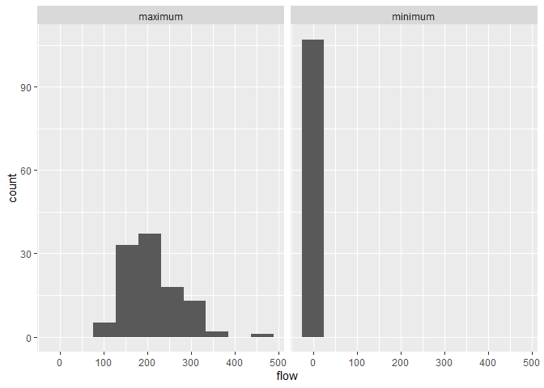
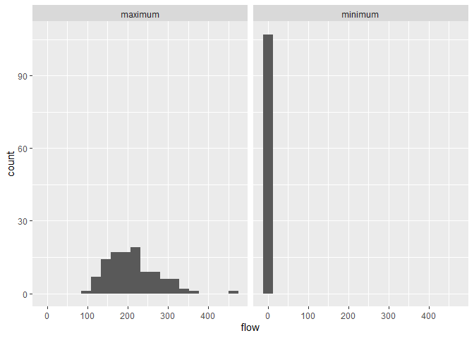
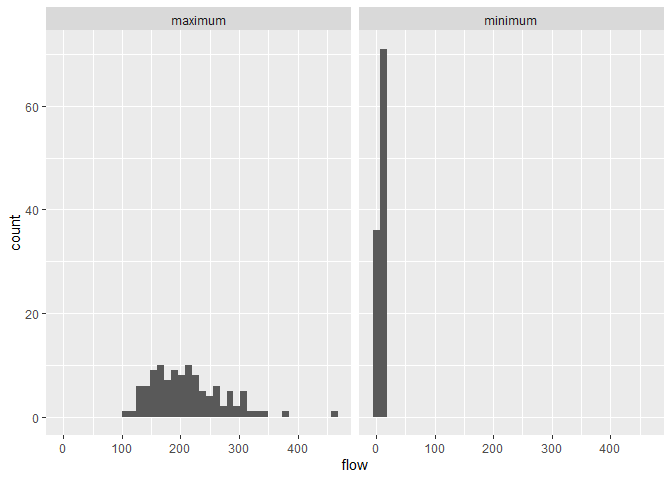
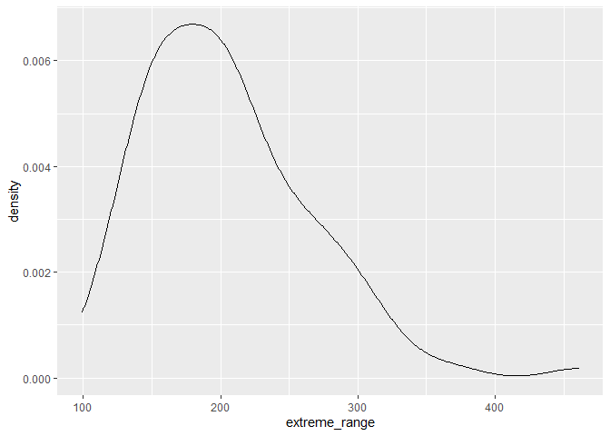
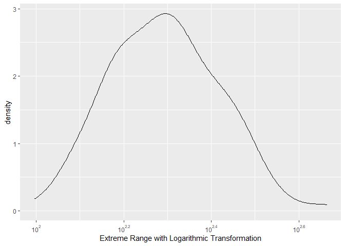
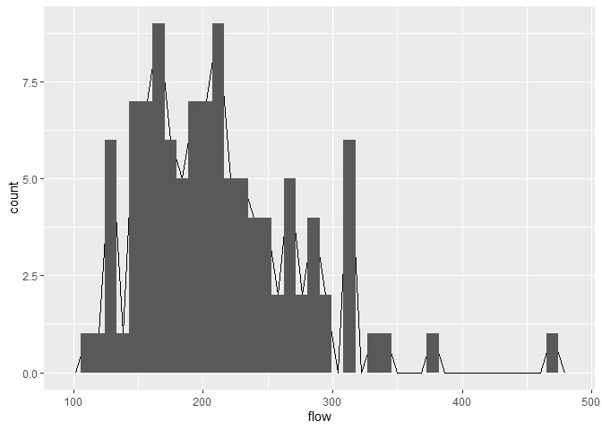
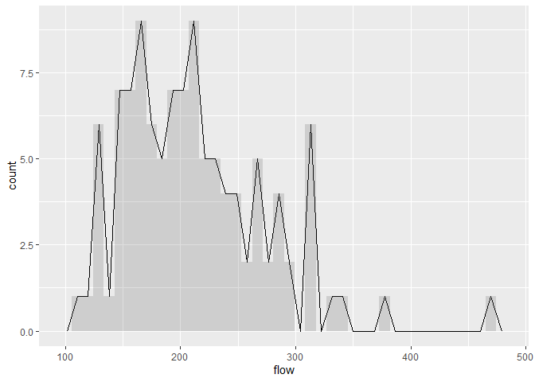
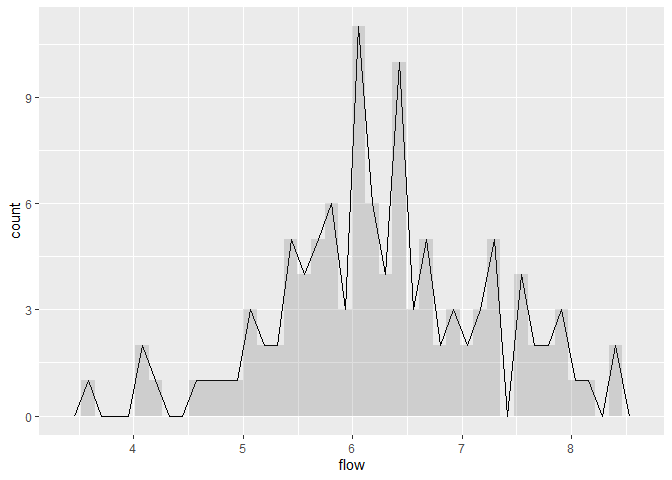
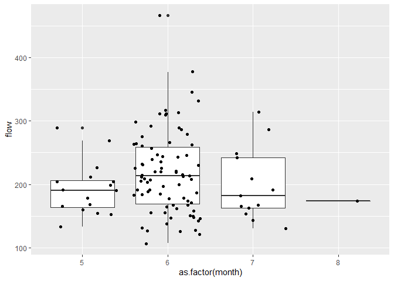

Mini Data Analysis Milestone 2
================

*To complete this milestone, you can either edit [this `.rmd`
file](https://raw.githubusercontent.com/UBC-STAT/stat545.stat.ubc.ca/master/content/mini-project/mini-project-2.Rmd)
directly. Fill in the sections that are commented out with
`<!--- start your work here--->`. When you are done, make sure to knit
to an `.md` file by changing the output in the YAML header to
`github_document`, before submitting a tagged release on canvas.*

# Welcome back to your mini data analysis project!

This time, we will explore more in depth the concept of *tidy data*, and
hopefully investigate further into your research questions that you
defined in milestone 1.

**NOTE**: The main purpose of the mini data analysis is to integrate
what you learn in class in an analysis. Although each milestone provides
a framework for you to conduct your analysis, it’s possible that you
might find the instructions too rigid for your data set. If this is the
case, you may deviate from the instructions – just make sure you’re
demonstrating a wide range of tools and techniques taught in this class.

Begin by loading your data and the tidyverse package below:

``` r
library(datateachr) # <- might contain the data you picked!
library(tidyverse)
# library(ggplot2)
library(scales)
```

# Learning Objectives

By the end of this milestone, you should:

-   Become familiar with manipulating and summarizing your data in
    tibbles using `dplyr` and `tidyr`, with a research question in mind.
-   Understand what *tidy* data is, and how to create it. In milestone
    3, we will explore when this might be useful.
-   Generate a reproducible and clear report using R Markdown.
-   Gain a greater understanding of how to use R to answer research
    questions about your data.

**Things to keep in mind**

-   Remember to document your code, be explicit about what you are
    doing, and write notes in this markdown document when you feel that
    context is required. Create your analysis as if someone else will be
    reading it! **There will be 2.5 points reserved for reproducibility,
    readability, and repo organization.**

-   Before working on each task, you should always keep in mind the
    specific **research question** that you’re trying to answer.

# Task 1: Process and summarize your data (15 points)

From milestone 1, you should have an idea of the basic structure of your
dataset (e.g. number of rows and columns, class types, etc.). Here, we
will start investigating your data more in-depth using various data
manipulation functions.

### 1.1 (2.5 points)

First, write out the 4 research questions you defined in milestone 1
were. This will guide your work through milestone 2:

<!-------------------------- Start your work below ---------------------------->

1.  *What is the distribution of the extreme flow?*
2.  *What is the distribution of the range of the flow in a year?*
3.  *What are the distributions of the maximum and minimum of the flow?*
4.  *Does the maximum of flow relate to month?*
    <!----------------------------------------------------------------------------->

### 1.2 (10 points)

Now, for each of your four research questions, choose one task from
options 1-4 (summarizing), and one other task from 4-8 (graphing). You
should have 2 tasks done for each research question (8 total). Make sure
it makes sense to do them! (e.g. don’t use a numerical variables for a
task that needs a categorical variable.). Comment on why each task helps
(or doesn’t!) answer the corresponding research question.

Ensure that the output of each operation is printed!

**Summarizing:**

1.  Compute the *range*, *mean*, and *two other summary statistics* of
    **one numerical variable** across the groups of **one categorical
    variable** from your data.
2.  Compute the number of observations for at least one of your
    categorical variables. Do not use the function `table()`!
3.  Create a categorical variable with 3 or more groups from an existing
    numerical variable. You can use this new variable in the other
    tasks! *An example: age in years into “child, teen, adult, senior”.*
4.  Based on two categorical variables, calculate two summary statistics
    of your choosing.

**Graphing:**

5.  Create a graph out of summarized variables that has at least two
    geom layers.
6.  Create a graph of your choosing, make one of the axes logarithmic,
    and format the axes labels so that they are “pretty” or easier to
    read.
7.  Make a graph where it makes sense to customize the alpha
    transparency.
8.  Create 3 histograms out of summarized variables, with each histogram
    having different sized bins. Pick the “best” one and explain why it
    is the best.

Make sure it’s clear what research question you are doing each operation
for!

<!------------------------- Start your work below ----------------------------->

**Q1: What is the distribution of the extreme flow?**

Q1.1 *Summarizing 1*: Here I calculate the *range*, *mean*, *median*,
*sd*, and *sample size* for the extreme flow.

All these descriptive statistical indexes are useful for depict the
distribution of the extreme flow.

``` r
flow_sample %>%
  group_by(extreme_type)%>%
  summarise(flow_mean = mean(flow,na.rm=T),flow_range=max(flow,na.rm = T)-min(flow,na.rm = T),flow_median=median(flow,na.rm = T),flow_sd=sd(flow,na.rm = T),flow_n=length(na.omit(flow)))
```

    ## # A tibble: 2 x 6
    ##   extreme_type flow_mean flow_range flow_median flow_sd flow_n
    ##   <chr>            <dbl>      <dbl>       <dbl>   <dbl>  <int>
    ## 1 maximum         212.       359         204     61.7      109
    ## 2 minimum           6.27       4.82        6.15   0.965    107

``` r
# Here the range is defined as the difference between the largest and smallest values.For more details, please check https://en.wikipedia.org/wiki/Range_(statistics) 
```

Q1.2 *Graphing 8*: Create 3 histograms out of flow with 10, 20, and 40
bins. I think the histogram with 40 bins is the best one which provide
more information and more accurate relationships of the data. With only
10 and 20 bins, some bins plot the distribution in a crude way (i.e.,
just one bin), especially for the minimum part.

The histogram is useful to visualize the distribution of extreme flow,
which helps to answer this research question.

``` r
ggplot(flow_sample, aes(flow)) +
  facet_wrap(~ extreme_type)+
  geom_histogram(bins = 10 )
```

    ## Warning: Removed 2 rows containing non-finite values (stat_bin).

<!-- -->

``` r
ggplot(flow_sample, aes(flow)) +
  facet_wrap(~ extreme_type)+
  geom_histogram(bins = 20 )
```

    ## Warning: Removed 2 rows containing non-finite values (stat_bin).

<!-- -->

``` r
ggplot(flow_sample, aes(flow)) +
  facet_wrap(~ extreme_type)+
  geom_histogram(bins = 40 )
```

    ## Warning: Removed 2 rows containing non-finite values (stat_bin).

<!-- -->

**Q2:What is the distribution of the range of the flow in a year?** Note
that the original question is How Does the range of the flow change in a
year? I revised it a little bit to make it more suitable and clear for
the following analysis.

Q2.1 *Summarizing 3*: Here I create a categorical variable with 3 or
more groups from an existing numerical variable.

Generally speaking, this does not help for current question without any
further theoretical backgrounds. Although 3 groups are created, the
cutting points are arbitrary.

``` r
flow_sample_new <- flow_sample %>%
  pivot_wider(id_cols = c(year,station_id), names_from = extreme_type,values_from = flow)%>%
  mutate(extreme_range= maximum-minimum)%>%
  mutate(range_level=case_when(extreme_range<200 ~ "low",
                               extreme_range<300 ~ "moderate",
                               T~"high"
                               ))
table(flow_sample_new$range_level)
```

    ## 
    ##     high      low moderate 
    ##       11       56       42

Q2.2 *Graphing 6*: Create a graph, make one of the axes logarithmic, and
format the axes labels. Original distribution is a positive skew, and
logarithmic transformation is useful to depict the distribution of the
range.

It is useful to find that the distribution of range is log-normal by
checking the plot, which helps answer the research question.

``` r
ggplot(flow_sample_new,aes(extreme_range))+
  geom_density()
```

    ## Warning: Removed 2 rows containing non-finite values (stat_density).

<!-- -->

``` r
ggplot(flow_sample_new,aes(x=extreme_range))+
  scale_x_log10("Extreme Range with Logarithmic Transformation", 
    breaks = trans_breaks("log10", function(x) 10^x),
    labels = trans_format("log10", math_format(10^.x)))+
  geom_density()
```

    ## Warning: Removed 2 rows containing non-finite values (stat_density).

<!-- -->

**Q3 What are the distributions of the maximum and minimum of the
flow?**

Q3.1 *Summarizing 2*: Compute the number of observations for at least
one of your categorical variables by `count()`.

This is also useful to get the sample sizes for the maximum and minimum
of the flow, which helps answer the research question.

``` r
flow_sample %>%
  count(extreme_type)
```

    ## # A tibble: 2 x 2
    ##   extreme_type     n
    ##   <chr>        <int>
    ## 1 maximum        109
    ## 2 minimum        109

Q3.2 *Graphing 7*: Make a graph where it makes sense to customize the
alpha transparency. Here I combine the `histogram()` and `freqpoly()`,
and to avoid the overlapping, the transparency is controlled.

This histogram help us understand the distribution of the maximum and
minimum of the flow.

Note that there is no need to combine the `histogram()` and `freqpoly()`
in practice. But I don’t want to repeat the task. Task 8 is more
reasonable, and the code are listed below.

``` r
flow_sample %>%
  filter(extreme_type=="maximum")%>%
  ggplot(aes(flow)) +
  geom_freqpoly(bins = 40)+
  geom_histogram(bins = 40)
```

<!-- -->

``` r
flow_sample %>%
  filter(extreme_type=="maximum")%>%
  ggplot(aes(flow)) +
  geom_freqpoly(bins = 40)+
  geom_histogram(bins = 40,alpha=0.2)
```

<!-- -->

``` r
flow_sample %>%
  filter(extreme_type=="minimum")%>%
  ggplot(aes(flow)) +
  geom_freqpoly(bins = 40)+
  geom_histogram(bins = 40,alpha=0.2)
```

    ## Warning: Removed 2 rows containing non-finite values (stat_bin).

    ## Warning: Removed 2 rows containing non-finite values (stat_bin).

<!-- -->

``` r
# flow_sample %>%
#   filter(extreme_type=="maximum")%>%
#   ggplot(aes(flow)) +
#   geom_histogram(bins = 10 )
# 
# 
# flow_sample %>%
#   filter(extreme_type=="maximum")%>%
#   ggplot(aes(flow)) +
#   geom_histogram(bins = 20 )
# 
# 
# flow_sample %>%
#   filter(extreme_type=="maximum")%>%
#   ggplot(aes(flow)) +
#   geom_histogram(bins = 40)
```

4.  *Does the maximum of flow relate to month?*

Q4.1 *Summarizing 1* Compute the range, mean, and two other summary
statistics of one numerical variable across the groups of one
categorical variable from your data. Please note only 1 observation is
in August, so the results are a little weird but acceptable.

Understand the descriptive statistical indexes can help us understand
the relationship between the each group of month, which can be used for
further analysis, e.g., ANOVA, to answer research question.

``` r
flow_sample %>%
  filter(extreme_type=="maximum")%>%
  group_by(month)%>%
  summarise(maximum_range=max(flow,na.rm = T)-min(flow,na.rm = T), maximum_mean = mean(flow,na.rm=T),maximum_median=median(flow,na.rm = T),maximum_sd=sd(flow,na.rm = T), maximum_n = length(flow))
```

    ## # A tibble: 4 x 6
    ##   month maximum_range maximum_mean maximum_median maximum_sd maximum_n
    ##   <dbl>         <dbl>        <dbl>          <dbl>      <dbl>     <int>
    ## 1     5           156         194.           190.       41.8        16
    ## 2     6           359         218.           213        65.4        79
    ## 3     7           184         200.           182        56.9        13
    ## 4     8             0         174            174        NA           1

Q4.2 *Graphing 5*:Create a graph out of summarized variables that has at
least two geom layers. Combine the jitter plot and box plot can help us
visualize the observations and their quadrilles.

From the plot and means, we can found June is related to higher
maximums, which can help us to answer that the maximum of flow relates
to month.

``` r
# flow_sample %>%
#   filter(extreme_type=="maximum")%>%
#   ggplot(aes(month,flow))+
#   geom_point()+
#   geom_smooth()

flow_sample %>%
  filter(extreme_type=="maximum")%>%
  ggplot(aes(as.factor(month),flow))+
  geom_boxplot()+
  geom_jitter()
```

<!-- -->

<!----------------------------------------------------------------------------->

### 1.3 (2.5 points)

Based on the operations that you’ve completed, how much closer are you
to answering your research questions? Think about what aspects of your
research questions remain unclear. Can your research questions be
refined, now that you’ve investigated your data a bit more? Which
research questions are yielding interesting results?

<!------------------------- Write your answer here ---------------------------->

For Q1, the descriptive statistical indexes and the histogram have
already answered the research question based on the paradigm in my
research field. And the results show the difference between two types of
extreme value. Further research questions may think about analysing the
data by distinguishing the type of extreme value.

For Q2, the original question is “How Does the range of the flow change
in a year?”. This question is not clear enough, which may be answered in
an open-end way. So, I refine it as: What is the distribution of the
range of the flow in a year? Based on the logarithmic transformation, we
can find the distribution of the range should follow log-normal
distribution. However, the question may need more statistical testing to
prove the log-normal distribution. Although creating the low, moderate,
and high range group are kind of arbitrary, it is interesting to combine
categories variables with other variables. For example, the range groups
may also relate to month.

For Q3, the histograms have partly answer answered the research question
about the distributions of the maximum and minimum of the flow. However,
the question may need more statistical indexes rather than a single
plot. The distributions of the maximum and minimum of the flow may
follow normal distribution, but they are not perfect.

For Q4, the descriptive statistical indexes and the boxplot cannot fully
answer the question. This question needs approaches from inferential
statistics. A linear regression model can be useful to answer this
question. In this way, I can refine the question as “Does the maximum of
flow significantly differ from month?”.
<!----------------------------------------------------------------------------->

# Task 2: Tidy your data (12.5 points)

In this task, we will do several exercises to reshape our data. The goal
here is to understand how to do this reshaping with the `tidyr` package.

A reminder of the definition of *tidy* data:

-   Each row is an **observation**
-   Each column is a **variable**
-   Each cell is a **value**

*Tidy’ing* data is sometimes necessary because it can simplify
computation. Other times it can be nice to organize data so that it can
be easier to understand when read manually.

### 2.1 (2.5 points)

Based on the definitions above, can you identify if your data is tidy or
untidy? Go through all your columns, or if you have &gt;8 variables,
just pick 8, and explain whether the data is untidy or tidy.

<!--------------------------- Start your work below --------------------------->

Considering the definition of tidy data, my data are tidy. As the
`glimpse()`and `head`shows, Each row is an **observation** for this
station at the specific time. and Each column is a **variable**:
station\_id is a categorical variable to recognize the station; year,
month, and day are the variables for the date; extreme\_type is a
categorical variable to distinguish the type of flow; sym is a a
categorical variable, but I cannot find any further description from the
official website. From each variable, we can find that Each cell is a
**value** for a specific variable.

``` r
glimpse(flow_sample)
```

    ## Rows: 218
    ## Columns: 7
    ## $ station_id   <chr> "05BB001", "05BB001", "05BB001", "05BB001", "05BB001", "0~
    ## $ year         <dbl> 1909, 1910, 1911, 1912, 1913, 1914, 1915, 1916, 1917, 191~
    ## $ extreme_type <chr> "maximum", "maximum", "maximum", "maximum", "maximum", "m~
    ## $ month        <dbl> 7, 6, 6, 8, 6, 6, 6, 6, 6, 6, 6, 7, 6, 6, 6, 7, 5, 7, 6, ~
    ## $ day          <dbl> 7, 12, 14, 25, 11, 18, 27, 20, 17, 15, 22, 3, 9, 5, 14, 5~
    ## $ flow         <dbl> 314, 230, 264, 174, 232, 214, 236, 309, 174, 345, 185, 24~
    ## $ sym          <chr> NA, NA, NA, NA, NA, NA, NA, NA, NA, NA, NA, NA, NA, NA, N~

``` r
head(flow_sample)
```

    ## # A tibble: 6 x 7
    ##   station_id  year extreme_type month   day  flow sym  
    ##   <chr>      <dbl> <chr>        <dbl> <dbl> <dbl> <chr>
    ## 1 05BB001     1909 maximum          7     7   314 <NA> 
    ## 2 05BB001     1910 maximum          6    12   230 <NA> 
    ## 3 05BB001     1911 maximum          6    14   264 <NA> 
    ## 4 05BB001     1912 maximum          8    25   174 <NA> 
    ## 5 05BB001     1913 maximum          6    11   232 <NA> 
    ## 6 05BB001     1914 maximum          6    18   214 <NA>

``` r
summary(flow_sample$sym)
```

    ##    Length     Class      Mode 
    ##       218 character character

<!----------------------------------------------------------------------------->

### 2.2 (5 points)

Now, if your data is tidy, untidy it! Then, tidy it back to it’s
original state.

If your data is untidy, then tidy it! Then, untidy it back to it’s
original state.

Be sure to explain your reasoning for this task. Show us the “before”
and “after”.

<!--------------------------- Start your work below --------------------------->

Now our data are tidy, then untidy them by storing the same variable in
multiple columns, i.e., in wide format, according to extreme\_type.

``` r
flow_sample_untidy <- flow_sample %>%
  pivot_wider(id_cols = c(station_id,year), names_from = extreme_type, values_from = c(month,day,flow,sym))

head(flow_sample) #before
```

    ## # A tibble: 6 x 7
    ##   station_id  year extreme_type month   day  flow sym  
    ##   <chr>      <dbl> <chr>        <dbl> <dbl> <dbl> <chr>
    ## 1 05BB001     1909 maximum          7     7   314 <NA> 
    ## 2 05BB001     1910 maximum          6    12   230 <NA> 
    ## 3 05BB001     1911 maximum          6    14   264 <NA> 
    ## 4 05BB001     1912 maximum          8    25   174 <NA> 
    ## 5 05BB001     1913 maximum          6    11   232 <NA> 
    ## 6 05BB001     1914 maximum          6    18   214 <NA>

``` r
head(flow_sample_untidy) #after
```

    ## # A tibble: 6 x 10
    ##   station_id  year month_maximum month_minimum day_maximum day_minimum
    ##   <chr>      <dbl>         <dbl>         <dbl>       <dbl>       <dbl>
    ## 1 05BB001     1909             7            NA           7          NA
    ## 2 05BB001     1910             6            NA          12          NA
    ## 3 05BB001     1911             6             2          14          27
    ## 4 05BB001     1912             8             3          25          14
    ## 5 05BB001     1913             6             3          11          18
    ## 6 05BB001     1914             6            11          18          17
    ## # ... with 4 more variables: flow_maximum <dbl>, flow_minimum <dbl>,
    ## #   sym_maximum <chr>, sym_minimum <chr>

For the untidy data, I transform them back.

``` r
flow_sample_tidy <- flow_sample_untidy %>%
  pivot_longer(cols = c(-station_id,-year), names_to =c(".value","extreme_type"), names_sep = "_")%>%
  arrange(extreme_type,year)

head(flow_sample) #original
```

    ## # A tibble: 6 x 7
    ##   station_id  year extreme_type month   day  flow sym  
    ##   <chr>      <dbl> <chr>        <dbl> <dbl> <dbl> <chr>
    ## 1 05BB001     1909 maximum          7     7   314 <NA> 
    ## 2 05BB001     1910 maximum          6    12   230 <NA> 
    ## 3 05BB001     1911 maximum          6    14   264 <NA> 
    ## 4 05BB001     1912 maximum          8    25   174 <NA> 
    ## 5 05BB001     1913 maximum          6    11   232 <NA> 
    ## 6 05BB001     1914 maximum          6    18   214 <NA>

``` r
head(flow_sample_untidy) # untidy
```

    ## # A tibble: 6 x 10
    ##   station_id  year month_maximum month_minimum day_maximum day_minimum
    ##   <chr>      <dbl>         <dbl>         <dbl>       <dbl>       <dbl>
    ## 1 05BB001     1909             7            NA           7          NA
    ## 2 05BB001     1910             6            NA          12          NA
    ## 3 05BB001     1911             6             2          14          27
    ## 4 05BB001     1912             8             3          25          14
    ## 5 05BB001     1913             6             3          11          18
    ## 6 05BB001     1914             6            11          18          17
    ## # ... with 4 more variables: flow_maximum <dbl>, flow_minimum <dbl>,
    ## #   sym_maximum <chr>, sym_minimum <chr>

``` r
head(flow_sample_tidy) # tidy
```

    ## # A tibble: 6 x 7
    ##   station_id  year extreme_type month   day  flow sym  
    ##   <chr>      <dbl> <chr>        <dbl> <dbl> <dbl> <chr>
    ## 1 05BB001     1909 maximum          7     7   314 <NA> 
    ## 2 05BB001     1910 maximum          6    12   230 <NA> 
    ## 3 05BB001     1911 maximum          6    14   264 <NA> 
    ## 4 05BB001     1912 maximum          8    25   174 <NA> 
    ## 5 05BB001     1913 maximum          6    11   232 <NA> 
    ## 6 05BB001     1914 maximum          6    18   214 <NA>

<!----------------------------------------------------------------------------->

### 2.3 (5 points)

Now, you should be more familiar with your data, and also have made
progress in answering your research questions. Based on your interest,
and your analyses, pick 2 of the 4 research questions to continue your
analysis in milestone 3, and explain your decision.

Try to choose a version of your data that you think will be appropriate
to answer these 2 questions in milestone 3. Use between 4 and 8
functions that we’ve covered so far (i.e. by filtering, cleaning,
tidy’ing, dropping irrelvant columns, etc.).

<!--------------------------- Start your work below --------------------------->

I choose *Q2: What is the distribution of the range of the flow in a
year?* and *Q4: Does the maximum of flow relate to month?* For Q2, we
can create the low, moderate, and high range groups, which is
interesting to combine this variable with other variable for further
analysis. For Q4, this question needs approaches from inferential
statistics,i.e., linear model, which is very suitable for milestone 3.

Q2: The range of the flow in a year need to calculated by wide format,
and the variables about station\_id, sym, day, and month are not useful:
(1) There is only one station\_id; (2) There are too many missing values
with sym; (3) There is no need to have day and month for the range **in
a year**.

``` r
flow_sample_q2 <- flow_sample %>%
  pivot_wider(id_cols = c(year,station_id), names_from = extreme_type,values_from = flow)%>%
  mutate(extreme_range= maximum-minimum)%>%
  mutate(range_level=case_when(extreme_range<200 ~ "low",
                               extreme_range<300 ~ "moderate",
                               T~"high"
                               ))%>%
  select(-station_id)
head(flow_sample_q2)
```

    ## # A tibble: 6 x 5
    ##    year maximum minimum extreme_range range_level
    ##   <dbl>   <dbl>   <dbl>         <dbl> <chr>      
    ## 1  1909     314   NA              NA  high       
    ## 2  1910     230   NA              NA  high       
    ## 3  1911     264    5.75          258. moderate   
    ## 4  1912     174    5.8           168. low        
    ## 5  1913     232    6.12          226. moderate   
    ## 6  1914     214    7.16          207. moderate

Q4: As mentioned before, station\_id and sym are not required. Then for
the question 4 *Does the maximum of flow relate to month?*, we only need
extreme\_type==“maximum”. And then all the extreme\_type is maximum now,
we do not need extreme\_type anymore. Finally, drop all the NA.

``` r
flow_sample_q4 <- flow_sample %>%
  select(-c(station_id,sym))%>%
  filter(extreme_type=="maximum")%>%
  select(-extreme_type)%>%
  drop_na()
head(flow_sample_q4)
```

    ## # A tibble: 6 x 4
    ##    year month   day  flow
    ##   <dbl> <dbl> <dbl> <dbl>
    ## 1  1909     7     7   314
    ## 2  1910     6    12   230
    ## 3  1911     6    14   264
    ## 4  1912     8    25   174
    ## 5  1913     6    11   232
    ## 6  1914     6    18   214

<!----------------------------------------------------------------------------->

*When you are done, knit an `md` file. This is what we will mark! Make
sure to open it and check that everything has knitted correctly before
submitting your tagged release.*

### Attribution

Thanks to Victor Yuan for mostly putting this together.
